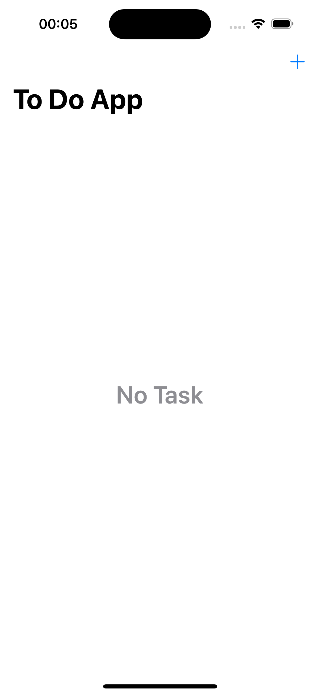
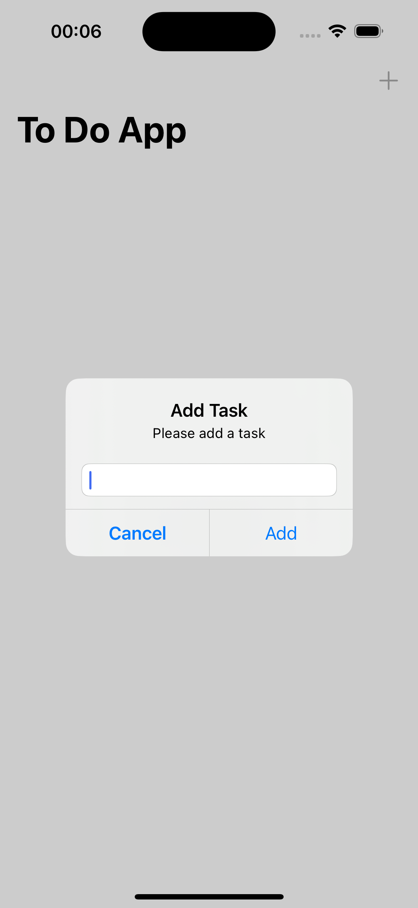
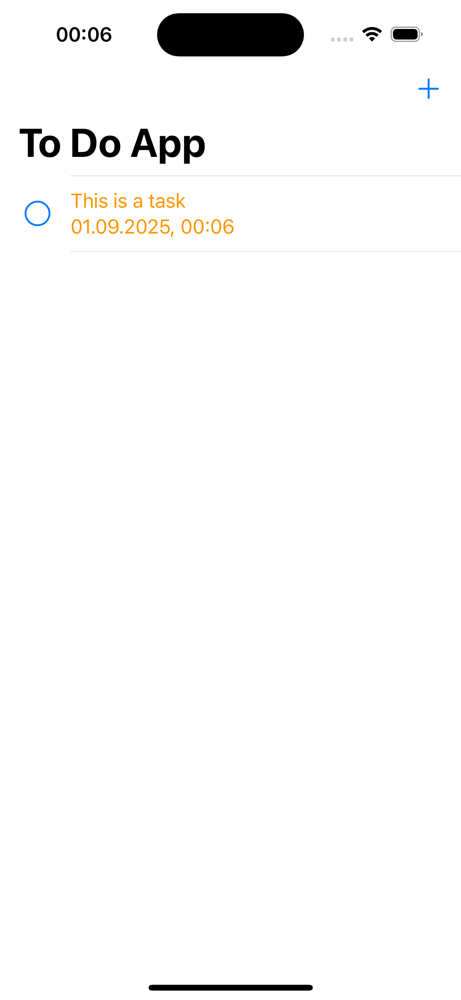
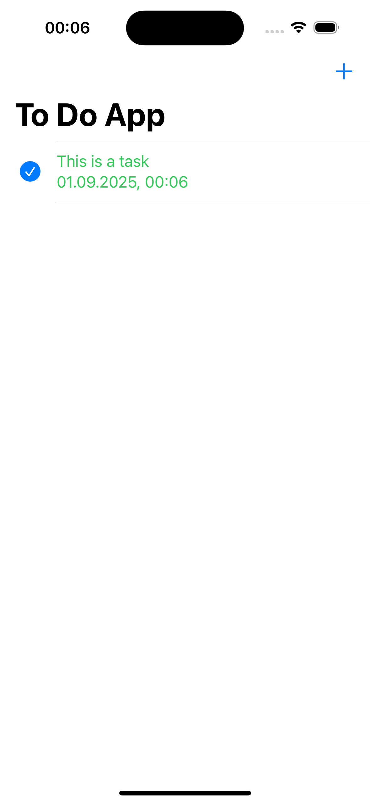
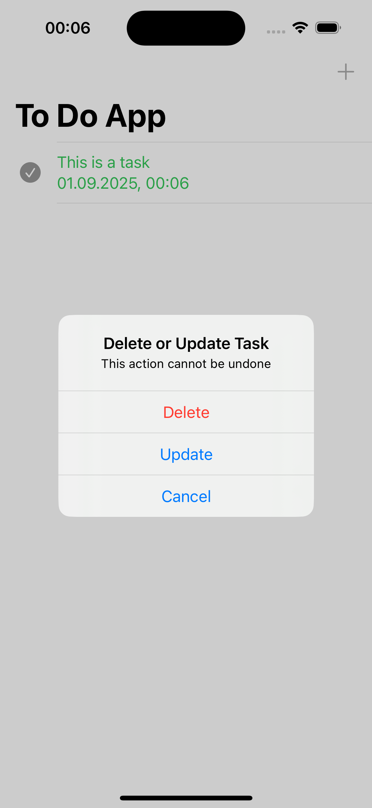

# ToDoApp
Simple iOS ToDo application built with UIKit and Core Data.

## Features
- Add new tasks
- Update or delete tasks with long press
- Confirmation alert before deleting
- Toggle task completion (done/undone) with tap
- Checkmark icon for done/undone state
- Improved colors for task states (green/orange)
- Clear button in alert textfields
- "No Task" message when the list is empty

## Screenshots

### Main Screen

### Add Task

### Pending Task

### Completed Task

### Edit Task

